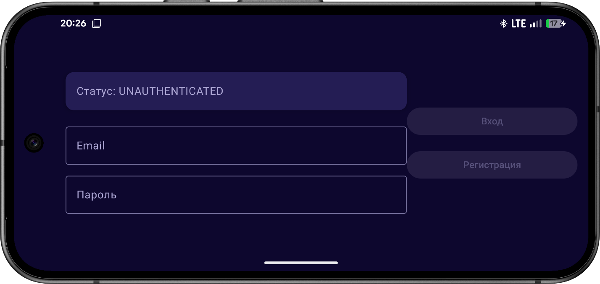
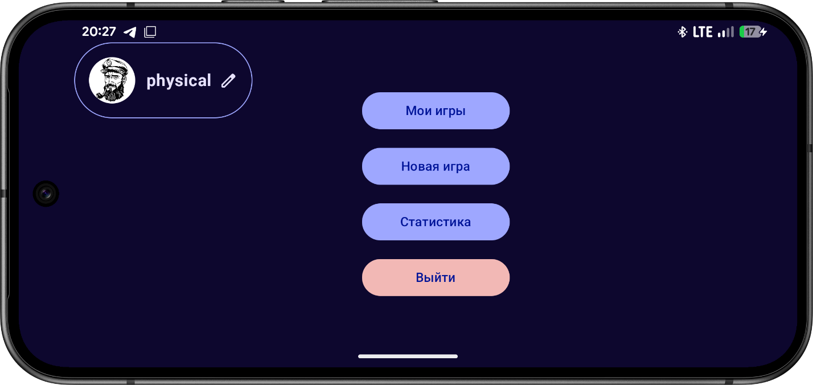

## SeaBattle

SeaBattle is a real-time Android Battleship game for two players.
Users can sign up, create or join matches, place ships, and play turn-by-turn battles.
The app also includes profile, active games, and game statistics screens.

## Tech Stack

- **Kotlin** - main language for all app logic.
- **Jetpack Compose + Material 3** - modern declarative UI and components.
- **Navigation Compose** - screen navigation and game flow routing.
- **Firebase Authentication** - email/password sign-in and sign-up.
- **Firebase Firestore** - cloud storage for users, games, moves, and game state updates.
- **Firebase Crashlytics** - crash reporting for production diagnostics.

## Screenshots

  

  

  

  

  

